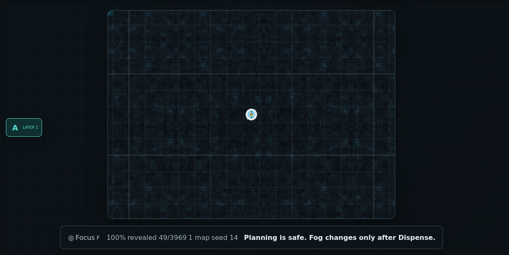
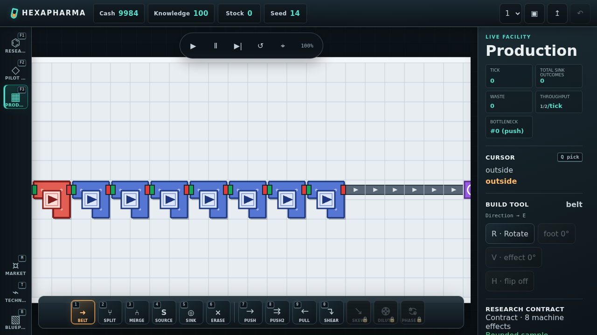
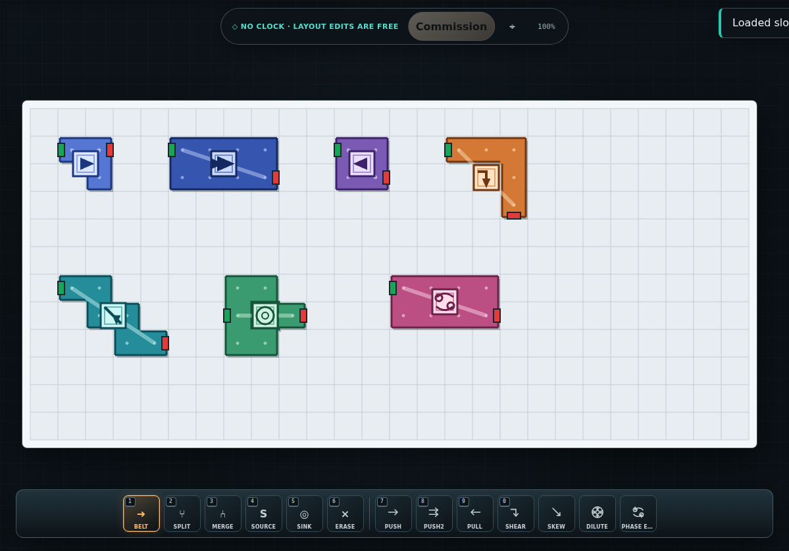

# HexaPharma UI 與直接操作契約

## 1. 方向

介面必須像工廠遊戲，而不是以表單、資料表、Recipe cards 與 submit buttons 串成的網站。中央世界負責連續空間操作；DOM chrome 只處理工具選擇、狀態、離散管理與危險確認。

借鏡而不複製：

- **Big Pharma**：產線、機器 footprint、輸入輸出與瓶頸同屏可讀。[官方 Steam 頁](https://store.steampowered.com/app/344850/Big_Pharma/)
- **shapez 1**：世界優先、低摩擦 pick/place/erase、清楚方向 glyph、快速鏡頭與 toolbar。[官方 Steam 頁](https://store.steampowered.com/app/1318690/shapez/)
- **Factorio**：一致 hotkeys、cursor tool、pipette、旋轉、copy/paste 與 undo 心智模型。[官方網站](https://www.factorio.com/)
- **Potion Craft**：大探索圖遠大於 viewport、開局中心、迷霧限制資訊。[官方 Steam 頁](https://store.steampowered.com/app/1210320/Potion_Craft_Alchemist_Simulator/)

競品只用於互動原則研究；runtime assets、icons、colors、layout 與 screenshot baselines 均為 HexaPharma 原創。

## 2. Before / current

舊版問題：

目前基線：

固定 baseline 不是要求像競品 pixel-perfect，而是防止 giant overlay、debug raw labels、機器退回同色格、畫布縮小、遮擋或 layout overflow 回歸。

## 3. Shell / navigation

- HUD 高 58–62px，只放跨建築資源與 Save controls：Cash、Knowledge、Stock、Seed、slot、Save/Load/Rewind。
- 左 rail 只有三個建築：F1 Research、F2 Pilot Plant、F3 Production。
- Market/Technology/Blueprints 是 M/T/B drawers；X/Escape 關閉。它們不是 F4+ 建築 tab。
- 已造訪建築保持 mounted 以保存 camera/tool/history；hidden page 不接 gameplay keys。
- message layer 不攔 pointer；error 有 `role=alert`，status 進 live region。

## 4. Shared facility editor

Research Route Floor、Pilot Plant、Production 使用同一個 `FactoryLayout` editor：

- LMB click/drag place；RMB drag erase；一個 gesture 是一筆 history。
- Shift+LMB 或 MMB pan；wheel 以游標為 anchor zoom；camera 不改 authority。
- `1` Belt、`4` Source、`5` Sink、`6` Erase；Pilot/Production 的 `2/3` 才是 Split/Merge。Research 不顯示也不接受 split/merge hotkeys。
- `7–0` machine tools；world machine body 使用連續 footprint chassis、machine-family palette、flow spine、transform pictogram 與實體 ports，不畫 raw typeId/`⏱speed` debug label。belt 是連續 rail/chevron，不是滿格按鈕。
- `R` footprint/direction、`V` effect rotation、`H` effect flip、`Q` pipette；`Ctrl+C/X/V`、`Ctrl+Z/Y`。
- placement 前顯示完整 footprint ghost 與 valid/invalid；ports 固定以 input/output notches辨識。
- bottom hotbar 是持續的 cursor tool belt，不是多個 submit forms。inspector 顯示 hover、tool orientation、sample/contract、metrics 與少量明確 operations。
- compact commissioned floor 首次開啟，或收到 same-size transfer／Blueprint load 時，把外部 layout bounds 捲入 hotbar 上方可見區；自己的逐格編輯不搶鏡頭。

## 5. Research

Research 是同一建築內的兩個工作面：**Effect Atlas** 與 **Route Floor**。desktop/compact 都用 modebar 明確切換，避免把兩套座標疊成一張難讀畫面；camera/tool state 切換後保留。

### Atlas

- authority `63×63`，viewport intrinsic `704×512`，100% 約 40px/cell；平常只見小部分。
- frame 永遠維持 `704:512` intrinsic aspect；CSS 可等比縮放，不能把正方格拉成長方格。
- A 層新局 start/origin 顯示為相對 `(0,0)`，位於一個 origin-aligned 5×5 major block 正中間。
- minor every cell、major every 5 cells；沒有玩家 X/Y 十字軸或 coordinate crosshair。
- drag/wheel；Focus/F 只做一次置中，shot/drug update 不 auto-follow。
- opaque fog 先遮 terrain/features；grid 可穿 fog 提供尺度，但不能透露 cure/wall/hazard。
- shot 已完成的 physical steps 畫 cyan trail；swap 用斷線表示非 sweep。token 移動與文字 step 同步。
- 底部 status 是固定高度 bar，不得因 CSS `top+bottom` 拉成覆蓋全圖的 pill。

### Route Floor / Dispense

- authority 是唯一 source→machines→sink connectivity，沒有 editable Recipe timeline。
- Research palette 不提供 splitter/merger；invalid topology 在 Dispense/Blueprint capture 顯式拒絕。
- planning/ghost/hover 不揭霧、不扣 cash。
- Route Floor 不執行或顯示免費 sample outcome；唯一揭示藥效的操作是付費 Dispense。
- Dispense 扣一顆成本後逐 machine advance；執行中 highlight current physical machine，完成 step 才畫 trail/揭霧。
- Abort 明示 no refund。只有 completed non-failed cure 顯示 Send to Pilot Plant。

## 6. Pilot Plant

- 獨立 F2 page，不是 overlay 或 Pilot Bench。
- No clock、free edits；沒有 Production transport controls。
- inspector 即時顯示完整 actual sample outcome（cures、side effects、final endpoints）、throughput、bottleneck 與 Research contract matches/differs。
- 可在 contract 前自由做 `pilot-plant` Blueprint；沒有 Research contract 時 commission disabled。
- commission 只接受實體 layout 的 `factoryOutcome` 等於 contract；成功 exact copy，失敗不 repair。

## 7. Production

- 未 commission 顯示 world-grid offline state與 Go to Pilot，不給可繞過流程的空白 editor。
- commissioned 後唯一出現 Play/Pause/Step/Reset、tick、sink outcomes、waste、throughput、bottleneck。
- edit Production 可以做 routing/parallel optimization，但所有 sink outputs 仍由 live contract validation 決定 inventory/waste。

## 8. Drawers

- Market/Technology cards 可用按鈕，因它們是離散管理決策。
- Blueprint drawer：capture Research/Pilot、strict paste/upload、download、apply/delete。Library lifecycle 與 save slot 完全分離。
- destructive deeper-map Technology 使用 modal，完整列出三場域/inventory/fog/sales reset 並二次確認；一般操作不用 modal。

## 9. Visual acceptance

- desktop world+canvas 至少是 facility stage 的主要寬度；inspector 不覆蓋 canvas。1440/1280 目標 ≥80%，1024 仍明顯大於 inspector；窄屏改上下配置但 canvas/hotbar 都可達。
- 機器以不同 silhouette、footprint、semantic glyph、ports 與 bottleneck highlight辨識；source/sink/split/merge 不使用 SRC/SINK/S/M raw debug text。
- chrome 使用低裝飾、清楚邊界與短動畫；禁止 giant blur/pill 遮世界。
- Playwright 固定 Research Atlas、commissioned Production、七 machine-family gallery 與 390px Research/Pilot baselines；另驗 compact controls 不被 nav 遮住、drawer/modal focus 與零 page errors。

## 10. Copyright boundary

- 不抓取或打包競品 screenshots、sprites、icons、fonts、sounds、CSS、UI layouts。
- `public/assets/lab/README.md` 記錄原創生成/處理與 runtime manifest。
- 文件只使用本專案 own screenshots；外部研究以官方連結引用。
