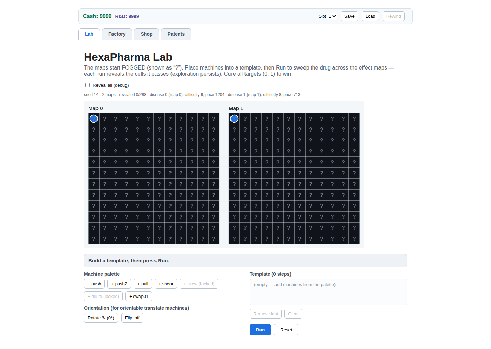
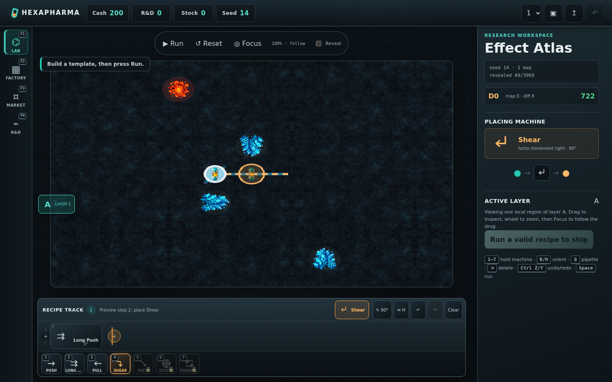
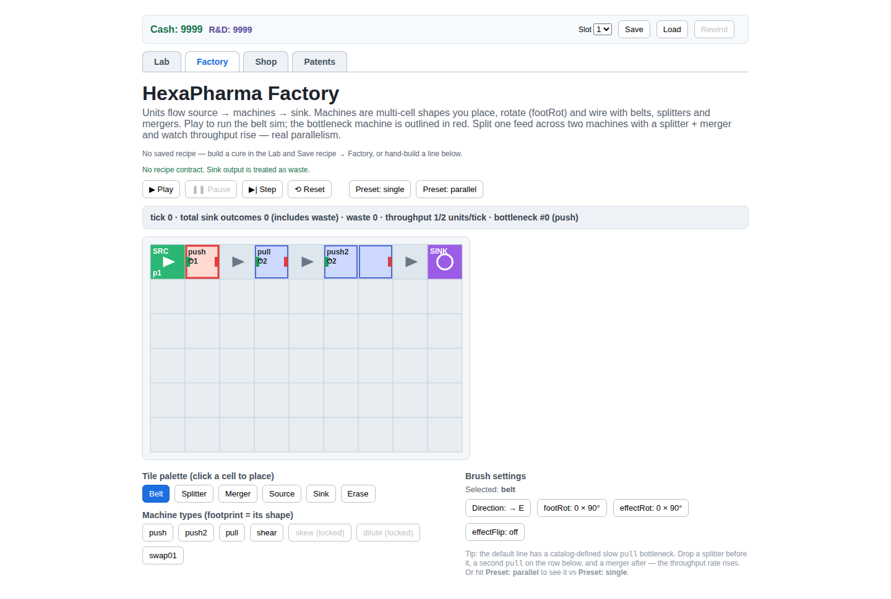
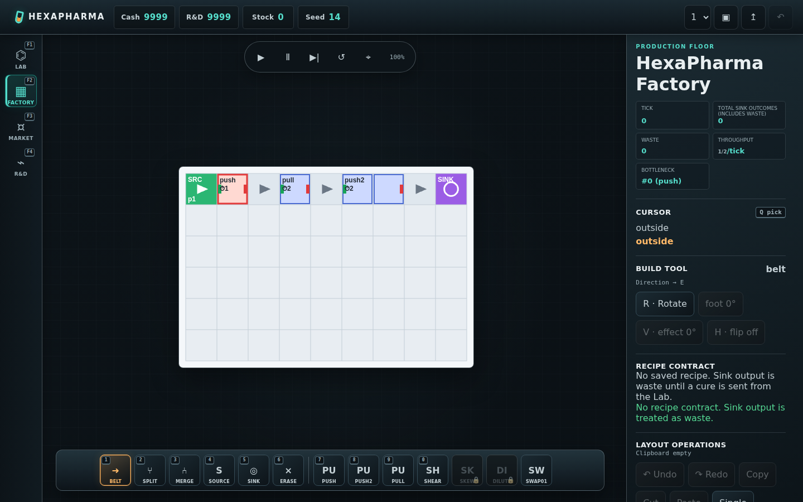
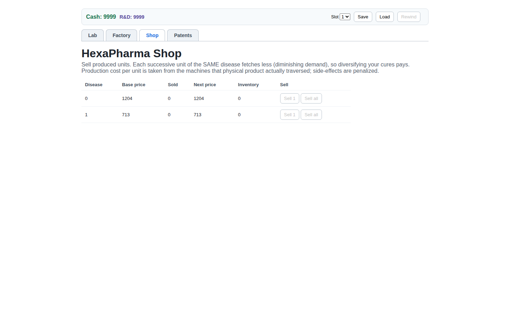
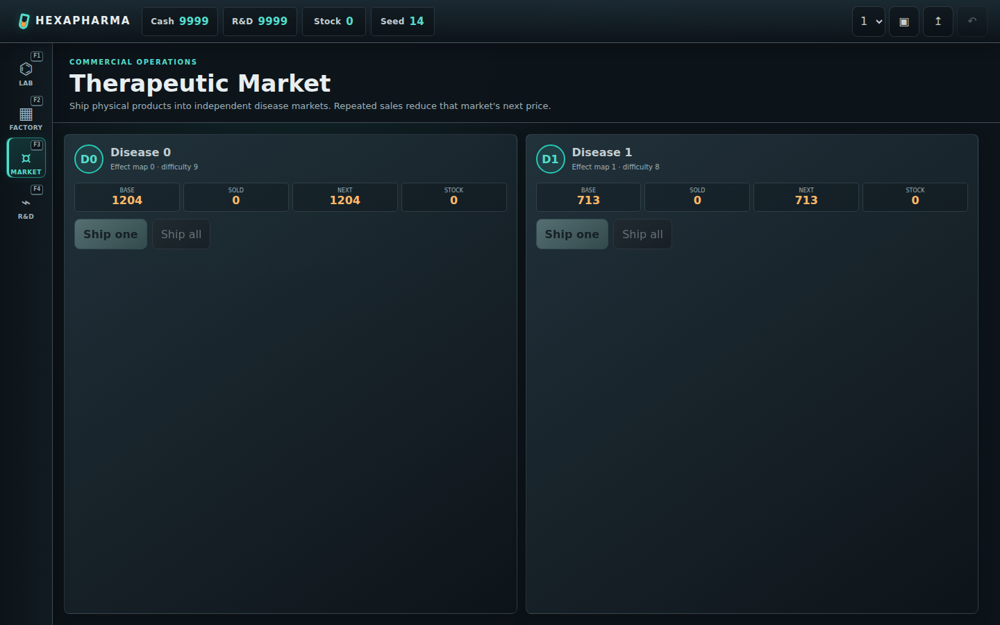
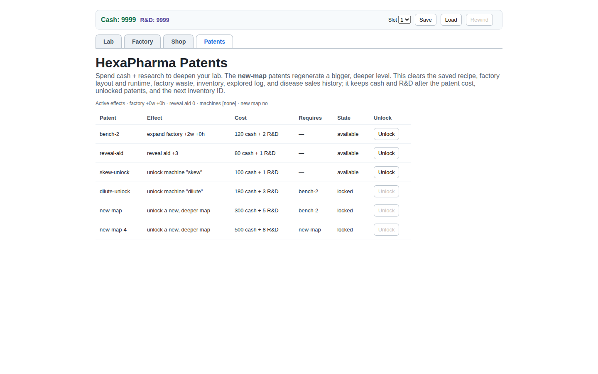
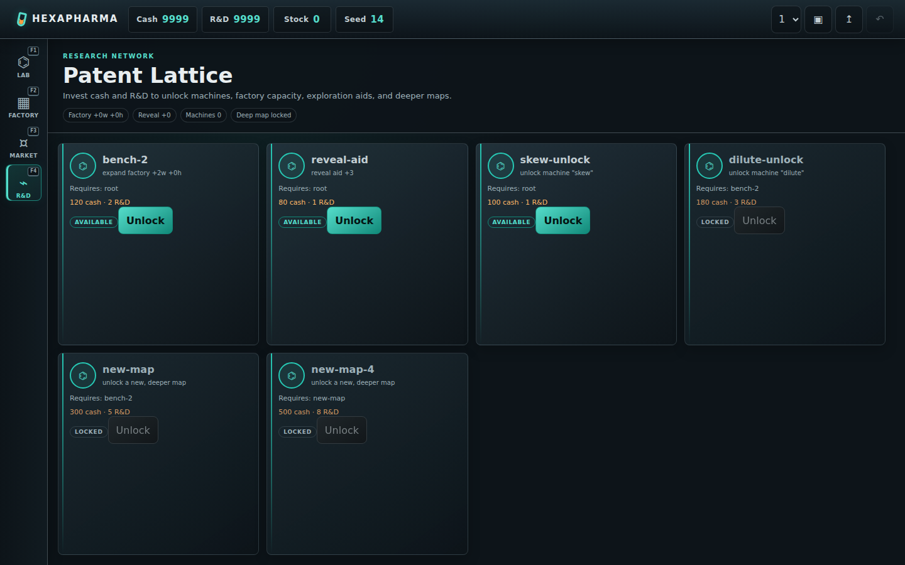

# HexaPharma UI 與直接操作契約

> Status: active design note 
> Scope: 遊戲 shell、研究室、工廠、Market、Patents 的玩家操作與資訊架構 
> Non-goal: 複製其他遊戲的美術、圖示、文案、音效或具辨識度的完整介面外觀

## 1. 問題與設計方向

舊版 UI 能完整操作 vertical slice，但主要是一般網頁的頁首、頁籤、表格、按鈕與表單。玩家是在「操作一個網站」，不是在「手持工具、直接修改工廠」。本輪 UI 的目標不是單純換色，而是把 interaction model 改成工廠遊戲的直接操作語言：

- 世界／工廠畫布是主要工作面，HUD 與工具只貼在邊緣。
- 玩家先選工具，再直接對世界 click、drag、rotate、erase、pick。
- hover、ghost、方向、產能、瓶頸與錯誤都盡量在操作焦點附近回饋。
- 高頻操作走一致快捷鍵；按鈕保留作 discoverability 與無滑鼠替代入口，不再是唯一入口。
- 只有不可逆或會重置大量進度的動作使用 modal；一般編輯不中斷世界操作。

HexaPharma 借鑑四款遊戲不同的強項：Big Pharma 的製藥工廠結構、shapez 2 的低摩擦編輯器、Factorio 的一致工具語言，以及 Potion Craft「從中心附近出發、只看大型探索圖局部」的空間感。這是功能與互動原則的綜合，不是任何一款遊戲的外觀 clone。

## 2. Before 基準

下列截圖是本 repo 的 redesign 前基準，只用來確認「從 web controls 轉為 game interaction」的差異。

### Lab

### Factory

### Market

### Patents

After 圖由主線在同一套 production UI 與固定 viewport 生成；競品圖片不得存入 repo 或成為遊戲資產。

## 3. 競品研究

### 3.1 比較矩陣

| 面向 | Big Pharma | shapez 2 | Factorio | HexaPharma 採用方向 |
| --- | --- | --- | --- | --- |
| 主工作面 | 等角工廠佔畫面主體；左側建造分類、底部全域狀態 | 近全螢幕工廠；資訊與工具貼四邊，底部上下文工具列 | 世界永遠在背景；底部 quickbar、角落資訊與局部 panel | viewport-filling shell；世界 canvas 優先，chrome 不形成網頁 column stack |
| 工具選取 | Belt、Basic、Advanced 等固定分類，數字鍵快速選 | 底部工具列、variant 與 selection actions | 物件進 cursor；quickbar `1`–`0`，`Q` pipette／clear cursor | Lab／Factory 永續 hotbar；slot 顯示 hotkey，工具狀態唯一且清楚 |
| 建造 | 選機器後在 factory floor 放置，建造時旋轉 | ghost preview、連續放置、區域操作、免費拆改 | LMB build、Shift+LMB ghost、`R` rotate | Factory LMB drag build；方向／footprint／effect orientation 分開呈現 |
| 拆除 | Delete tool | 區域 delete、快速重建 | RMB mine／deconstruction planner | RMB drag 即時 erase；Erase 仍留 hotbar 作可發現入口 |
| 複用與修正 | 主要強項不是 blueprint editor | cut/copy/paste、blueprints、undo/redo | pipette、copy/cut/paste、blueprints、undo/redo | `Q` pick；gesture 原子進 history；`Ctrl/Cmd+Z`、redo；後續 blueprint 仍沿同一 intent model |
| 鏡頭 | drag pan、wheel zoom、WASD；建造不中斷 | editor-style pan／zoom／多層視角 | WASD 與 wheel zoom；遠端視圖仍保留一般工具 | Factory Shift+LMB 或 MMB pan；wheel zoom；鏡頭不是表單狀態 |
| 檢查資訊 | 點 ingredient／產品／機器看詳細資料 | selection bar 與 open-machine animation 直接顯示流向 | hover info、entity GUI、Alt overlay、互動關係高亮 | 右側 persistent inspector；hover cell／entity、throughput、bottleneck、recipe contract 同屏 |
| 時間 | pause、normal／slow、2x／5x 有固定控制與快捷鍵 | pause 與速度快捷鍵固定在遊戲 HUD | 模擬繼續存在，panel 不必改成新頁 | canvas 上方 transport bar；Space play/pause，`.` single-step |
| 管理畫面 | Ingredients、Cures、Research、Company 為明確遊戲模式 | goals／research 以 cards、milestones 與 pinned tasks 呈現 | technology／production 等專用 panel，但保留一致 chrome | `F1`–`F4` nav rail；Market 與 Patents 用 cards／network，不回退到 HTML table |
| 錯誤回饋 | 選取與狀態回饋貼近工廠 | 預覽與 selection state 強烈可見 | 游標附近短訊息、error sound、互動對象高亮 | intent／renderer／analysis failure 必須可見；禁止靜默 no-op 或空 canvas |

Potion Craft 只作 Lab 空間尺度參考：探索圖應大於 viewport、開局位於中心附近、迷霧限制資訊；HexaPharma 不使用其羊皮紙、鍊金圖示、節點造型或介面 trade dress。參考：[Potion Craft 官方 Steam 頁](https://store.steampowered.com/app/1210320/Potion_Craft_Alchemist_Simulator/)與其公開遊戲截圖。

### 3.2 Big Pharma：製藥工廠的資訊骨架

可借鑑：

- factory floor 是主畫面；機器與 belts 直接在地圖放置。
- 左側固定建造工具分類，底部固定 Production／Ingredients／Cures／Research／Company 與時間狀態。
- 建造時用 `Q`／`E` 旋轉、`Tab` 取 belt tool、數字鍵選工具，代表高頻動作不依賴逐次點按文字按鈕。
- 管理決策可開獨立 panel，但不把每一格工廠操作變成 modal。
- Ingredients 同時呈現效果、價格、需求與飽和，說明 inspector 應連結物理流與經濟結果。

來源：

- [Big Pharma 官方 Steam 頁與官方截圖](https://store.steampowered.com/app/344850/Big_Pharma/?l=english)
- [Big Pharma controls 與遊戲流程指南](https://gamefaqs.gamespot.com/pc/180508-big-pharma/faqs/73022)
- [Big Pharma 官方 wiki：Ingredients](https://bigpharma.fandom.com/wiki/Ingredients)

### 3.3 shapez 2：低摩擦工廠編輯器

可借鑑：

- 世界幾乎填滿 viewport；HUD 半透明、貼邊且不搶工廠視覺權重。
- 選取物件後在同一個上下文工具列完成 rotate、mirror、delete、copy 等操作，不必跳頁。
- pipette／clone、connected selection、area deletion、clear contents、variant 與 level visibility 都有穩定快捷鍵。
- 官方功能明列 cut／copy／paste、blueprint library，以及最多 50 步 undo／redo；核心原則是允許玩家快速試錯，而非懲罰 UI 操作。
- open production buildings 與 shape preview 讓玩家不開 panel 也能辨識輸入、輸出與故障。

來源：

- [shapez 2 官方 Steam 頁](https://store.steampowered.com/app/2162800/shapez_2/?l=english)
- [shapez 2 Wiki：Codex 與即時 hotkey 說明](https://shapez2.wiki.gg/wiki/Codex)
- [shapez 2 Wiki：Blueprints](https://shapez2.wiki.gg/wiki/Blueprints)

### 3.4 Factorio：一致且可形成肌肉記憶的工具語言

可借鑑：

- LMB build、RMB remove、`R` rotate、`Q` pipette／clear cursor、wheel zoom 等動作跨物件一致。
- quickbar 永遠位於底部，是物件與 blueprints 的 shortcut，不是另一份 inventory；`1`–`0` 直接取 slot。
- shortcut bar 集中 undo／redo、cut／copy／paste、blueprint 與 deconstruction planners。
- 非法操作的短訊息放在游標焦點附近；hover 或建造有連接關係的實體時，高亮其互動對象與方向。
- panel 可以「glued-on」於世界視圖；開啟物流資料時仍可使用 quickbar、inventory 與世界建造。

來源：

- [Factorio 官方 Wiki：Controls](https://wiki.factorio.com/Controls)
- [Factorio 官方 Wiki：Quickbar](https://wiki.factorio.com/Quickbar)
- [Factorio 官方 Wiki：Shortcut bar](https://wiki.factorio.com/Shortcut_bar)
- [Factorio Friday Facts #261：interaction errors 與 relationship highlight](https://www.factorio.com/blog/post/fff-261)
- [Factorio Friday Facts #405：glued-on world-view panel](https://www.factorio.com/blog/post/fff-405)
- [Factorio Friday Facts #278：quickbar 與 ghost cursor 的設計理由](https://www.factorio.com/blog/post/fff-278)

## 4. HexaPharma 已採 UI 契約

本節是現行 active contract。後續 UI 修改若改變這些行為，必須同步更新本文與對應測試。

### 4.1 Full-screen game shell

- `.game-shell` 填滿 `100dvw × 100dvh`，頁面不得因主要遊戲內容產生 document-level 捲動。
- shell 由 persistent top HUD、left nav rail 與 game stage 組成；切 view 不重建整個網站式頁面。
- stage 內的 Lab／Factory 世界層佔主要空間；inspector、transport 與 hotbar 是 game chrome。
- 已造訪 view 保持 mounted，切換 Lab／Factory／Market／Patents 不應遺失暫時鏡頭與工具狀態。

### 4.2 Persistent HUD

- 頂部 HUD 永遠顯示 Cash、R&D、Stock、Seed。
- Save slot、Save、Load、Rewind／Recover 在同一 system strip；`Ctrl/Cmd+S` 是 save 快捷鍵。
- HUD 只呈現跨 view 的全域狀態。hover cell、recipe、throughput 等局部資訊不得塞進 HUD。
- error／save status 用獨立 message layer；錯誤必須具 `role="alert"`，成功／狀態訊息進 live region。

### 4.3 View navigation

| View | Rail | Hotkey |
| --- | --- | --- |
| Lab | Effect Atlas | `F1` |
| Factory | Production floor | `F2` |
| Market | Disease markets | `F3` |
| Patents | Research network | `F4` |

- active view 同時以位置、色彩、`aria-current="page"` 表示，不只靠色彩。
- nav rail 是遊戲模式切換，不是傳統 browser tabs。
- 編輯 input、select、textarea 或 contenteditable 時，全域 gameplay keys 不得攔截輸入。

### 4.4 Hotbar 與工具狀態

- Lab 與 Factory 在世界 viewport 底部提供永續 hotbar；工具 icon／glyph、名稱、hotkey 與 locked state 同時可見。
- hotbar slot 是高頻工具入口；文字 inspector 只解釋當前工具，不取代直接操作。
- Lab 的數字鍵／pointer 把機器拿到 cursor，先顯示預設尾端插入與地圖 route ghost，玩家點插入槽才 commit；Factory 的 `1`–`6` 分別選 Belt、Splitter、Merger、Source、Sink、Erase。
- 未解鎖機器顯示 locked state 且不可選；不能把拒絕藏成無反應。

### 4.5 Factory 直接操作

| 動作 | Pointer／Key | 契約 |
| --- | --- | --- |
| 連續建造 | LMB drag | drag 經過的 grid cells 依序 rasterize；整個 gesture 只產生一筆 undo history |
| 連續拆除 | RMB drag | 不必先切 Erase；同一 gesture 可刪 tiles 或 machine footprint |
| 選 Erase | `6` 或 hotbar | 為 discoverability／鍵盤操作保留，行為與直接 erase 一致 |
| Pipette | hover + `Q` | 取得 hovered tile／machine 及其方向、footprint rotation、effect orientation |
| 旋轉 | `R` | tile tool 旋轉 flow direction；machine tool 旋轉實體 footprint |
| Effect mirror | `H` | 只改 machine 的 drug-effect flip，不冒充 footprint mirror |
| Effect rotate | `V` | 只改 machine 的 drug-effect orientation，不改 factory footprint |
| Undo | `Ctrl/Cmd+Z` | 還原上一個已 commit 的 layout gesture |
| Redo | `Ctrl/Cmd+Y` 或 `Ctrl/Cmd+Shift+Z` | 重做 history；新 edit 會切斷 redo branch |
| Copy／cut／paste | hover + `Ctrl/Cmd+C/X/V` | 複製單一 tile／machine 的方向、footprint 與 effect orientation；cut／paste 各是一筆可復原 edit |
| Pan | Shift+LMB drag 或 MMB drag | 只改 camera transform，不修改 authoritative layout |
| Zoom | wheel | clamp 在可操作範圍；只改 camera，不重播 sim |
| Reset camera | transport `⌖` | 回到 100% 與初始中心，不修改 layout／runtime |
| Play／pause | `Space` | 在允許狀態切換模擬；deadlock 不假裝繼續播放 |
| Single step | `.` | 暫停時前進一 tick |

其他必要條件：

- pointer down 後使用 pointer capture，離開 cell 或快速 drag 仍能完成／取消 gesture。
- desktop gesture 使用 LMB/RMB/Shift/MMB；touch 以 tap 放置、超過移動閾值後改為 camera pan，避免手指拖動畫布時誤建造。
- world hit testing 必須以 canvas intrinsic size、CSS rect 與 camera transform 正確換算，不假設 1 CSS pixel 等於 1 canvas pixel。
- hover cell 形成 ghost／cursor highlight，inspector 同步顯示座標與 tile／machine kind。
- 工廠 layout 修改必須走 `setFactory` intent；React component 只擁有 editor state，不能繞過 sim authority。
- play、pause、single-step、reset 與 zoom readout 固定在 canvas 上方 transport bar，不與 layout operations 混成網頁表單。

### 4.6 Lab 操作

- Lab canvas 與 fog／effect maps 是主畫面；Recipe 是跨地圖底部的水平指令軌，disease readout 與所選機器說明才位於 inspector。預設只有一張 `63×63` Layer A，start/origin 在正中央 `(31,31)`。
- viewport intrinsic size 固定 `704×512`，100% 約顯示 `11×8` 格。地圖比 viewport 大很多；禁止為了同時看完全圖／多圖而縮 cell 或並排。
- pointer drag 平移，wheel 以游標錨定縮放（75–225%）；`F` 或 `Focus` 將鏡頭對準藥物並進入 follow。手動 pan／zoom 會離開 follow，camera只屬UI狀態。
- 解鎖多層後以 A–D layer tabs 或對應 hotkey 切 active layer；一次只畫一層，各層保留自己的 camera，renderer cull viewport 外 cells。
- 新局 fog visibility radius 3，先揭露 `7×7 = 49/3969` 格；未知區以 opaque microscope fog 完全遮蔽，不顯示「?」或任何牆／危險／療效輪廓。
- machine hotbar 使用與 Recipe 卡、inspector 相同的語意 SVG pictogram；Push／Long Push／Pull／Shear／Skew／Dilute／Phase Exchange 不再以 `PU/SH/SK` 或 raw transform string 當主要辨識。
- 選 hotbar 後進入 held placement，不直接修改 recipe。每兩張卡與首尾都有插入槽；hover/focus 插入槽先重算完整候選序列，地圖同時顯示已 commit cyan route、候選橙色虛線、revealed endpoint ghost 與第一個 hazard failure。點插入槽才 commit，held machine 會保留以便連續放置，Escape 取消。
- Recipe preview 與 sim 共用 `previewStep` 的逐格 sweep authority，牆停、hazard、scale、Phase Exchange 斷線不得由 UI 重寫近似邏輯。public preview 先把 unknown feature 視為不可判定；一旦某步進入第一個 unknown cell，就只畫到已知邊界、標示 uncertain，不公開該步 failure、endpoint 或 downstream 結果。hidden empty／wall／hazard 必須產生相同預覽。
- 點卡片選取該步並把地圖 scrub 到該步完成後；`R/H` 修改唯一的 held 或 selected translate，Delete 移除 selected，`Q` pipette selected，`Ctrl/Cmd+Z/Y` undo/redo。pointer capture drag 在落下前先重算候選順序與完整路線，放下後才形成一筆 history。
- Run 時指令軌 playhead 跟隨當前步驟，地圖畫實際 cyan route；Space 執行／停止實驗。Clear 是低頻整體動作，不再提供 Remove last 作主要修正模式。
- Phase Exchange A↔B 在只有A時是明示locked state；B解鎖後才可選，作用是交換A/B座標。B的near-center phase start與A不同，因此交換不是no-op；inspector顯示before/after語意，不以「交換0/1層」內部編號當玩家說明。
- Run、Clear、Send recipe to Factory 仍提供 visible controls；compact viewport 隱藏文字 inspector，但保留指令軌、hotbar、route preview 與送廠動作。

### 4.7 Inspector

- desktop 的 Lab／Factory inspector 固定在世界右側。compact Lab 隱藏詳細文字 inspector，把 held state、orientation、history 與送廠保留在底部指令軌；Factory 仍維持可達的獨立 inspector。世界本身不因長資訊上下移動。
- Factory inspector 至少顯示 tick、sink outcomes、waste、throughput、bottleneck、hover cursor、current brush、recipe contract、undo／redo。
- Factory editor 與 Recipe editor history 各最多保留 50 個完整 mutation snapshot；clipboard、selection、held machine、insertion hover 與 history 都是 UI editor state，不進 sim core。只有 committed `Template.steps` 可送進 Run／Game authority。
- Bounded analysis failure 與 renderer failure 顯式顯示；不得用 `unavailable` 掩蓋未報告的 exception，也不得把空 canvas 當成功。
- inspector 是狀態與低頻操作面；高頻 placement／erase／rotate 必須能在世界與 hotkeys 完成。

### 4.8 Market 與 Patents cards

- Market 以 disease cards 呈現 base price、sold、next price、stock 與 Sell actions，不使用 desktop-data-table 作主要 IA。
- Patents 以 research cards／network state 呈現 prerequisite、cost、effect、available／locked／unlocked；locked state 不只靠 disabled button。
- cards 必須在常用 viewport 自適應欄數，容器內捲動，不讓 document body 變成長網頁。
- cards 可以有按鈕，因這些是離散管理決策；它們不代表 Factory 應回退成 button grid。

### 4.9 Modal 使用邊界

- modal 只用於會清除 recipe、factory、runtime、inventory、fog 或 sales history 的 deeper-level reset 等高影響、難以誤觸後復原的決策。
- confirmation 必須說明保留與清除的狀態，提供明確 confirm／cancel。
- modal 使用 `role="alertdialog"`、`aria-modal="true"`，Escape 關閉，Tab focus 不得離開 dialog。
- 一般建造、拆除、rotate、sell、unlock 的可預期錯誤不得用阻塞 modal；使用 inline／toast／cursor-near feedback。

### 4.10 Visual hierarchy

- HexaPharma 自有視覺語言是深鋼藍／藥廠青綠／危險橙紅，搭配六角、藥瓶與效果方向 glyph；不是 Big Pharma 淡色等角 UI、shapez 2 太空工業皮膚或 Factorio 棕色 pixel chrome。
- Lab 的原創 microscopic biochemical atlas 位於 `public/assets/lab/`：cellular substrate、defocused fog、protein wall、corrosive hazard、violet side-effect colony、therapeutic receptor、capsule與token halo。`manifest.json` 是runtime契約，`README.md`記錄來源與權利；禁止用競品圖像或無提示debug fallback。
- Lab 編輯時以 cyan 顯示 committed route、橙色虛線顯示候選 route，橙色半透明 capsule 是 revealed 候選終點；Run 動畫改畫實際 cyan history。兩者都使用逐格 sweep，Phase Exchange 是不掃格的瞬移且前後斷線。unknown route/endpoint 被 fog mask；token halo 只標目前位置。Reset 清 recipe/route，探索 fog 仍持久保留。
- 世界內容優先於 panel chrome；active tool、selected state、locked state、warning 與 destructive action 必須有不同層級。
- 互動目標最小高度維持 44px；focus-visible 必須清楚，不能為了「像遊戲」移除鍵盤可達性。
- 動態效果是回饋，不是唯一資訊來源；方向、flow、selection、warning 同時需要靜態 glyph／文字或輪廓。

## 5. 測試與驗收

UI contract 需要下列層次共同守住：

1. **純函式 tests**：Lab/Factory camera、Recipe editor insert/move/orient/delete/history、逐格 preview/failed step/swap break/fog mask、SVG icon semantics、Factory grid/gesture/history。
2. **component／integration tests**：gameplay key 不攔截 form controls、intent rejection 顯示、modal keyboard/focus、locked tool／patent state。
3. **Playwright interactions**：viewport shell、HUD／nav／hotbar／inspector 可見；`F1`–`F4`；Lab held placement 在 commit 前不改 step、插入中間、選取旋轉、undo/redo、pointer drag reorder、route preview、A–D camera、Phase Exchange lock與fog 49/3969；Factory direct manipulation；form isolation、modal focus、390/768/1024 reachability。
4. **visual regression**：固定 viewport 比對 Lab／Factory／Market／Patents 的現行 baseline；評估 canvas 占比、遮擋、層級與 overflow，不以和競品的 pixel similarity 作成功標準。文件另保存 redesign 前後對照，但競品圖片不進 baseline。
5. **production preview**：lazy renderer、最大`64×64` Game map、固定`704×512` Lab viewport/culling、不同 browser viewport 都不得出現 page error、空 canvas、body overflow 或靜默 fallback。

## 6. 版權與參考素材邊界

可以借鑑：

- direct manipulation、tool-in-cursor、ghost preview、quickbar、hotkeys、pan／zoom、context inspector、undo／redo、blueprint 等抽象功能與慣例。
- 世界優先、edge HUD、資訊漸進揭露、錯誤貼近操作焦點等 interaction principles。
- 透過公開截圖研究資訊密度、canvas 占比與控制分區。

不可直接複製：

- 競品 sprites、icons、logos、fonts、screenshots、音效、動畫、專有文案與關卡內容。
- 能造成來源混淆的 exact palette、panel chrome、具辨識度 layout、icon silhouette 或 trade dress。
- 將 Steam／wiki／官網截圖納入本 repo、遊戲 bundle、宣傳素材或 visual regression baseline。

Factorio 官方 wiki 的 [Screenshots category](https://wiki.factorio.com/Category:Screenshots) 亦明確指出遊戲截圖仍受遊戲 copyright policies 約束。shapez 2 wiki 與 Factorio wiki 的文字／圖像各有自己的授權條款；本文件只做短摘要與連結，不重製其內容。所有 shipped UI assets 必須是 HexaPharma 原創或另有明確可用授權。

## 7. 決策摘要

- 我們要完整採用成熟工廠遊戲的直接操作深度，不採用其受保護的視覺表達。
- Factory 的主要動詞是 pick、place、drag、erase、rotate、mirror、undo、pan、zoom，不是 submit form。
- Lab／Factory 使用 canvas + hotbar + inspector；Market／Patents 使用 cards；modal 只保護高影響重置。
- buttons 是 hotkeys／pointer interaction 的可發現入口，而不是玩法本身。
- Before／After 截圖只評估 HexaPharma 自己的演進；競品截圖永不進 repo。
